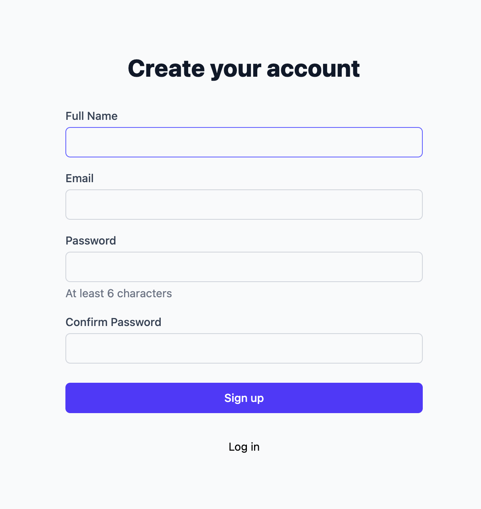
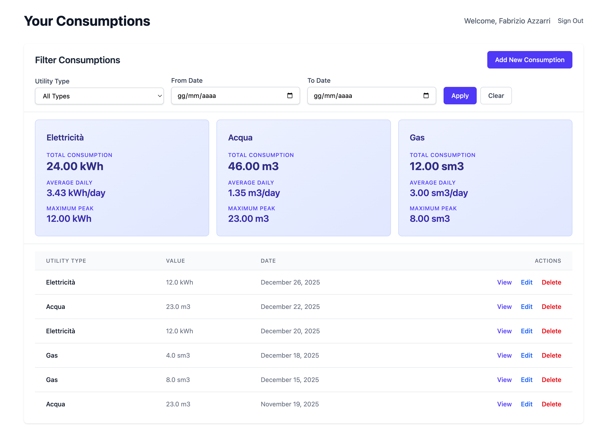
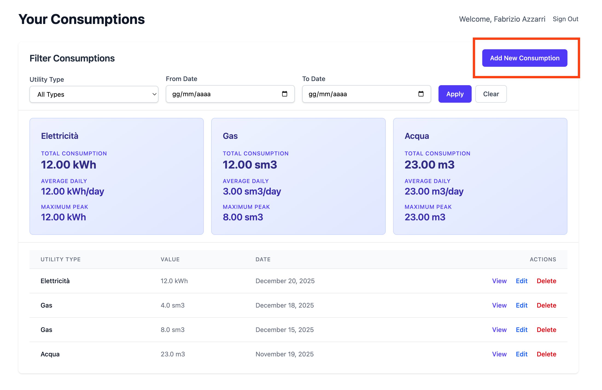
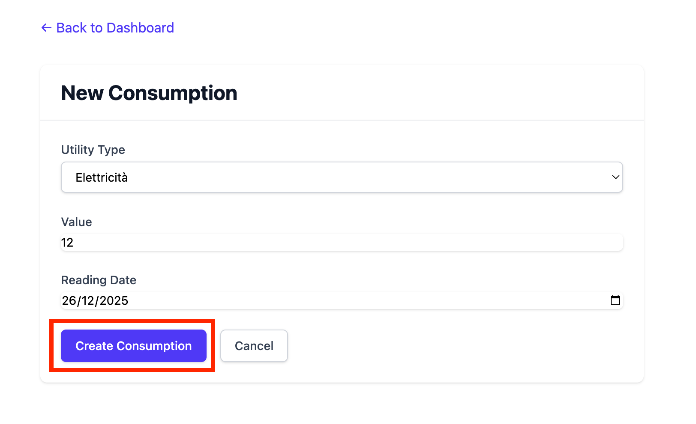
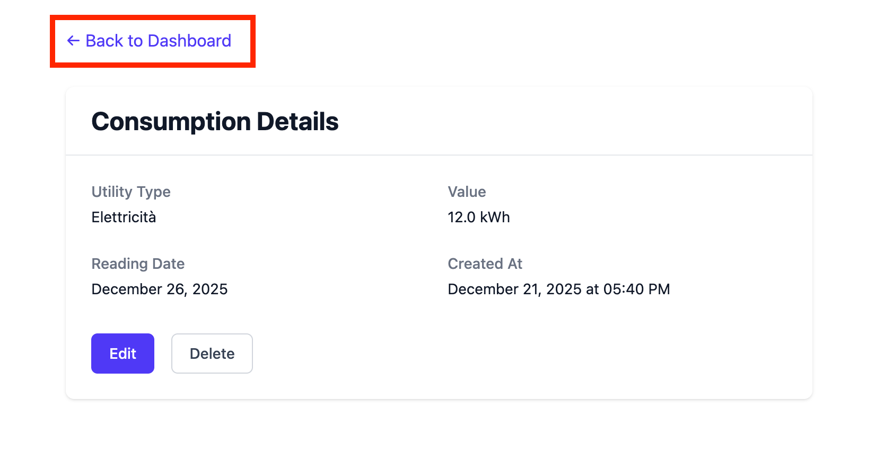
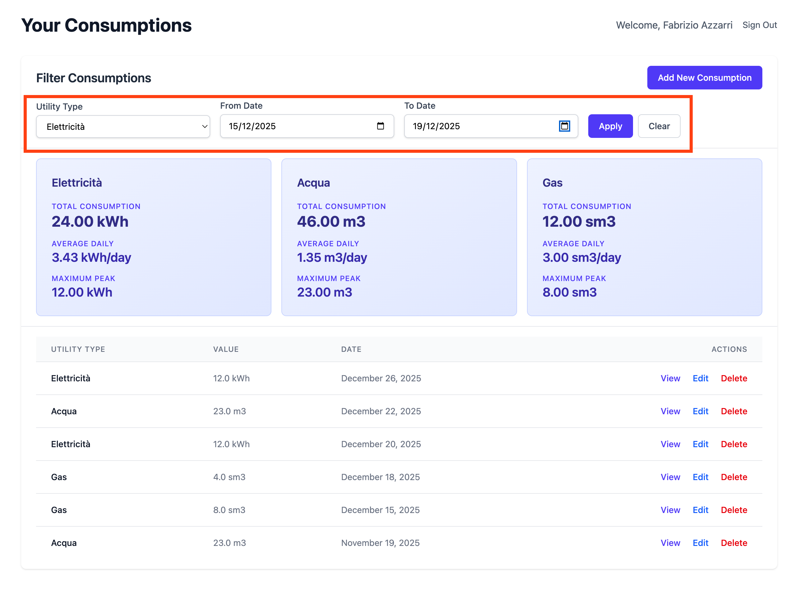

# Nexflow

A Rails 8 application for tracking utility consumptions.

## Requirements

- Ruby 3.3+
- Rails 8.1.1
- PostgreSQL
- Node.js (for asset compilation)
- [Overmind](https://github.com/DarthSim/overmind) (process manager)

## Getting Started

### 1. Install Dependencies

Install Ruby gems:
```bash
bundle install
```

Install JavaScript dependencies:
```bash
yarn install
```

### 2. Install Overmind

For macOS:
```bash
brew install overmind
```

For other platforms, see [Overmind installation guide](https://github.com/DarthSim/overmind#installation).

### 3. Database Setup

Create the database:
```bash
rails db:create
```

Run migrations:
```bash
rails db:migrate
```

Seed the database:
```bash
rails db:seed
```

### 4. Environment variables

Create the .env file in the root of the project and copy/paste inside the content of the .env.example file

### 5. Start the Development Server

Start all services with Overmind:
```bash
overmind s
```

This will start:
- Rails server (Puma)
- CSS build watcher (Tailwind)
- JavaScript build watcher (esbuild)

The application will be available at `http://localhost:3000`

### 6. Test

Run tests with RSpec:
```bash
rspec
```


## Usage

### 1. Sign up

Create your user compiling the required sign up form


### 2. Dashboard overview

In the dashboard you will find the list of all your consumptions, and the statistics boxes one for each utility, all filterable by utility, start date and end date.


### 3. Add consumptions

Add you consumptions by clicking on the "Add new consumption" button of the dashboard


Compile the form with your data and proceed with "Create consumption"


After created you can back to the dashboard


### 4. Filter data

You can easily filter your data by selecting one or more filters at once
